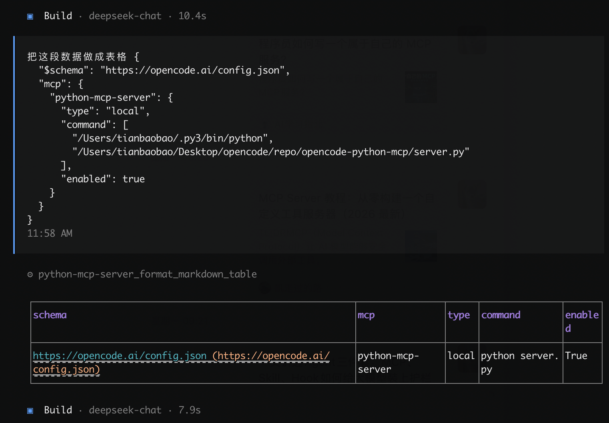

# opencode-python-mcp
The repo aims to run a python mcp server for opencode agent

## Python MCP

### MCP local server
Make sure python version is greater than 3.10

1. Setup python mcp package

    ```bash
    python3 -m venv ~/.py3
    source ~/.py3/bin/activate
    pip3 install mcp
    ```

2. Run python server

    ```
    nohup python3 server.py > server.log 2>&1 & disown
    pgrep -f server.py
    ```
3. Apply opencode MCP
    Add following python mcp server config into `~/.config/opencode/config.json`

    ```json

        {
    "$schema": "https://opencode.ai/config.json",
    "mcp": {
        "python-mcp-server": {
        "type": "local",
        "command": [
            "/Users/xxx/.py3/bin/python",
            "/Users/xxx/Desktop/opencode/repo/opencode-python-mcp/server.py"
        ],
        "enabled": true
        }
    }
    }
    ```

4. Verify MCP connectivity in opencode
    Check whether python mcp server is well connected in opencode

    ```bash
    opencode mcp list

    ┌  MCP Servers
    │
    ●  ✓ python-mcp-server connected
    │      /Users/xxx/.py3/bin/python /Users/xxx/Desktop/opencode/repo/opencode-python-mcp/server.py
    │
    └  1 server(s)
    ```

5. Utilize MCP
    - Use `add` tool in `server.py` via opencode
        ```bash
        opencode run "Use the add tool with a=2 and b=3"

        > build · deepseek-chat

        ⚙ python-mcp-server_add {"a":2,"b":3}

        5
        ```

    - Use `get_weather` tool in `server.py` via opencode
        ```
        opencode run "北京今天天气怎么样"

        > build · deepseek-chat

        ⚙ python-mcp-server_get_weather {"city":"北京"}

        北京今天天气晴朗，25°C。
        ```

    - Use `format_markdown_table` tool in `server.py` via opencode

        

## DOC

- https://opencode.ai/docs/mcp-servers/
- https://opencode.ai/docs/cli/
